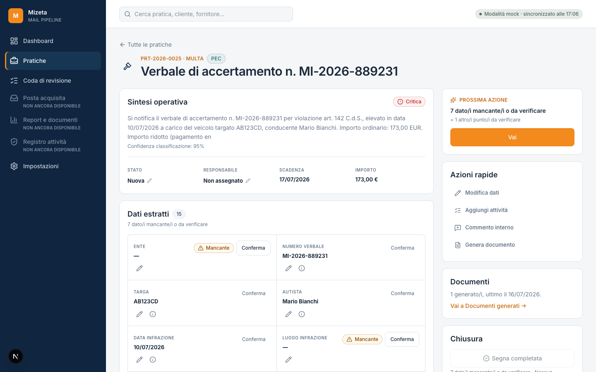
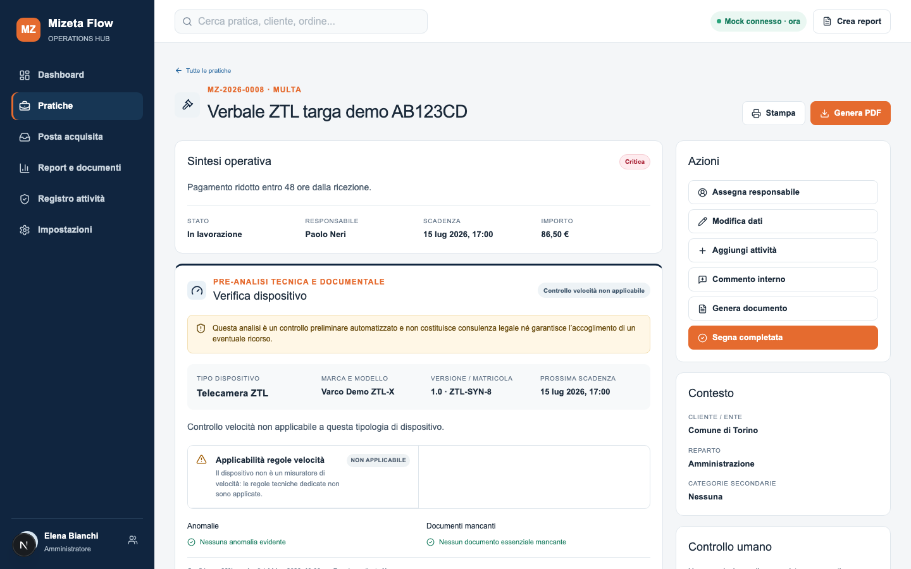
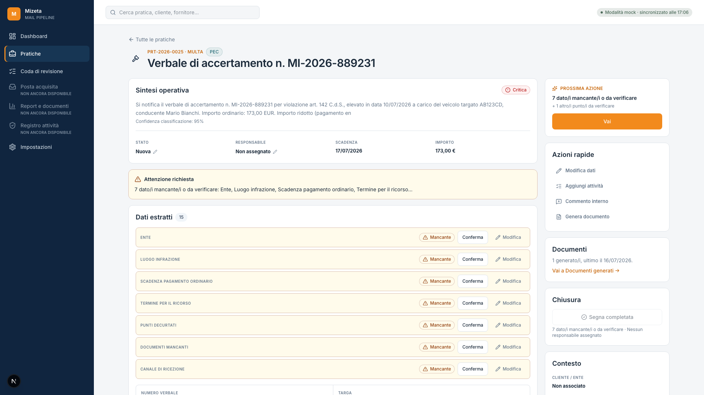
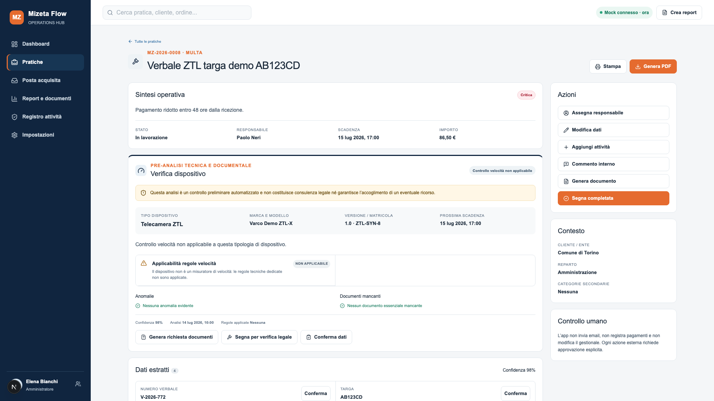

# UI Porting Report — Fase 8 (pilota)

Aggiornato progressivamente man mano che ogni vertical slice viene portata e verificata.
Vedi `docs/UI-PORTING-PLAN.md` per la matrice completa e il riferimento riproducibile
(SHA `2247f0e3765c01e313398b860fb727161a766736`).

## Pilota — shell, sidebar, topbar, dashboard, elenco pratiche

**Stato**: implementato e verificato via HTTP (typecheck/lint/test/build puliti,
verifica funzionale su dev server). **Nessuno screenshot visivo prodotto**: l'ambiente
di esecuzione di questa sessione non dispone di un tool di cattura schermo/browser
headless con rendering visuale, solo `curl` per verifiche HTTP/HTML. Questo è un
limite noto (vedi rischio "Nessun e2e visivo" nel piano) — il confronto pixel-per-pixel
con la reference resta da fare manualmente dall'utente (`npm run dev`, aprire `/` e
`/pratiche` in un browser, confrontare con gli screenshot già presenti in
`.reference/mizeta-flow` — vedi commit `2247f0e37` "Add UI reference screenshots" —
o con `docs/design-reference/`).

### Cosa è stato verificato (via HTTP, dev server su `npm run dev`)

| Verifica | Esito |
|---|---|
| `npm run typecheck` | pulito |
| `npm run lint` | pulito |
| `npm run test` (228 test, 43 file) | tutti passano, nessuna regressione |
| `npm run build` (produzione) | completata, `/` compare come rotta dinamica |
| Login ADMIN (`admin@mizeta.local`) → `GET /` | 200, dashboard reale |
| Saluto dashboard | `"Buongiorno, Amministratore"` (nome reale dalla sessione, non "Elena") |
| Eyebrow data | `"giovedì 16 luglio"` (data reale calcolata, non "Martedì 14 luglio") |
| 7 KPI card | tutte e 7 le etichette presenti (Da gestire oggi, Scaduti, Scadenze prossimi 7 giorni, Preventivi da rispondere, Reclami urgenti, Multe urgenti, Elementi da verificare) |
| Stringhe finte reference | `"Mock connesso · ora"` e `"Elena Bianchi"`: **assenti** |
| Pill di stato provider | `"Modalità mock · sincronizzato alle 17:06"` — dato reale da `getProviderStatusSummary()`, non hardcoded |
| `GET /pratiche` (con sessione) | 200, filtri+tabella presenti, **nessuna** etichetta KPI (spostate sulla dashboard) |
| `GET /` senza sessione | 307 → `/login` (autenticazione ancora enforced sulla nuova rotta radice) |
| Voci sidebar disabilitate | "Non ancora disponibile" compare 3 volte (Posta acquisita, Report e documenti, Registro attività); nessun `href="/posta"`, `"/report"`, `"/audit"` reale nel markup |
| Form di ricerca globale | `action="/pratiche"`, `name="q"` presenti nella topbar |
| `/revisione`, `/impostazioni` (ADMIN) | 200, nessuna regressione |
| `/impostazioni` (READ_ONLY) | redirect applicato (meta-refresh verso `/pratiche`, meccanismo di `redirect()` di Next.js per questa rotta — contenuto di Impostazioni assente dalla risposta) — permessi invariati |
| Pill di stato provider per READ_ONLY | presente, stesso dato aggregato dell'ADMIN — coerente con la decisione raccolta in fase di piano |
| `/pratiche/[id]` (dettaglio, fuori scope pilota) | 200, nessuna regressione da verificare oltre lo smoke test |

### Differenze note rispetto alla reference (motivate)

- **Pannello filtri+tabella non fuso in un unico box bordato** come nella reference
  (`.panel` con divisori interni): per il pilota, `FiltersBar` e `CasesTable` restano
  due blocchi bordati separati, impilati con uno spazio. La fusione visiva completa è
  stata valutata a rischio/beneficio sfavorevole per il pilota (richiede toccare la
  struttura interna di `CasesTable`, condivisa anche con la dashboard in modalità
  `compact`) — rimandata a un'eventuale rifinitura in FASE 3, documentata qui invece di
  essere implementata in modo affrettato.
- **Colonne tabella**: la reference mostra sempre Importo/Responsabile/Ultima attività;
  il target le mantiene come colonne opzionali personalizzabili (funzionalità più
  avanzata, esplicitamente da conservare) — non uniformato alla reference.
- **Card KPI cliccabili**: la reference le rende statiche (nessun link); il target le
  mantiene cliccabili verso l'elenco filtrato (funzionalità già presente, conservata).
  Un link preesistente rotto ("Da gestire oggi" puntava a un filtro rapido `oggi`
  inesistente lato server) è stato corretto in `dueToday` come parte della riscrittura.
- **Ricerca globale**: il placeholder non promette la ricerca per "ordine" (spedizioni/
  fatture), perché `getFilteredCases` non la implementa ancora — copy volutamente più
  onesta della reference.
- **Bottone "Sincronizza posta mock"**: non portato. Nessuna azione di sincronizzazione
  generica esiste nel target (solo sync per-mailbox, ADMIN, da Impostazioni); il
  bottone della reference è comunque simulato/senza handler. Per ADMIN, l'azione
  primaria della dashboard è un link reale a Impostazioni → Connessioni email.

## FASE 3, tappa 1 — dettaglio pratica (pagina unica, niente tab)

**Stato**: implementato e verificato via HTTP. Direttiva vincolante dell'utente:
pagina a scorrimento unico con colonna laterale sticky di azioni/contesto, nessun
componente `Tabs`. I 6 tab precedenti (Panoramica, Dati estratti, Email e allegati,
Attività e note, Bozze e documenti, Registro attività) sono confluiti in 11 sezioni
impilate nella colonna principale, nell'ordine della reference dove esiste un
equivalente (vedi matrice in `docs/UI-PORTING-PLAN.md`).

### Verificato via HTTP (dev server)

| Verifica | Esito |
|---|---|
| `npm run typecheck` | pulito |
| `npm run lint` | pulito |
| `npm run test` (228 test) | tutti passano |
| `npm run build` | completata |
| `role="tablist"` nel markup | **assente** (Tabs rimosso) |
| `id` delle 9 sezioni con ancoraggio (`anomalie`, `collegamenti`, `dati-estratti`, `email`, `bozza`, `documenti`, `attivita`, `commenti`, `registro`) | tutti presenti, **esattamente in quest'ordine** nel DOM |
| Link della colonna "Azioni" (`#dati-estratti`, `#attivita`, `#commenti`, `#documenti`) | presenti, puntano alle sezioni reali |
| Colonna laterale sticky (`lg:sticky lg:top-24`) | presente |
| Box "Contesto" e disclaimer "Controllo umano" | presenti, testo coerente con CLAUDE.md (invarianti 2 e 3) |
| `InlineSelect` Stato/Responsabile ancora funzionanti (dentro "Sintesi operativa") | presenti (`id="inline-select-status"`, `id="inline-select-assignedToId"`) |
| Toggle "Segna completata"/"Riapri pratica" nella colonna Azioni | presente, coerente con lo stato della pratica testata |

### Differenze note rispetto alla reference (motivate)

- **Verifica dispositivo multa** (`FineDeviceVerification` nella reference): non
  portata. Nessun equivalente nel modello Prisma del target — gap funzionale
  documentato in `docs/UI-PORTING-PLAN.md`, non colmato con una struttura visiva
  senza dati reali dietro (principio di veridicità).
- **Colonna "Azioni"**: la reference ha bottoni che presumibilmente aprono un flusso
  (mock, non presente nel codice sorgente esaminato); il target usa ancoraggi di
  navigazione reali verso le sezioni corrispondenti, già editabili inline dove
  possibile (Stato/Responsabile in "Sintesi operativa"), quindi "Assegna
  responsabile" non ha un bottone dedicato duplicato.
- **Allegati**: uniti dentro "Cronologia email" (annidati per messaggio) invece di
  restare una card separata come nel target precedente — aumenta la fedeltà alla
  reference senza perdere la funzione di download.
- **Nessuno screenshot visivo**: stesso limite ambientale del pilota (nessun tool
  browser/screenshot disponibile in questa sessione) — confronto visivo ancora da
  fare manualmente.

## FASE 8B — parità visiva del dettaglio pratica

Metodo: `scripts/ui-compare.ts` (nuovo, Playwright) avvia target e reference su porte
dedicate (mai la 3000), effettua login reale su entrambe, apre lo stesso tipo di
pratica (categoria `FINE_OR_PENALTY` — reference `case-008` "Verbale ZTL targa demo
AB123CD" per posizione nel seed array di `.reference/mizeta-flow/src/lib/mock-data.ts`,
non `case-007` come stimato inizialmente: la categoria `FINE_OR_PENALTY` è
all'indice 7, 0-based, non 6) e cattura screenshot full-page/above-the-fold a
1440×900 e 1920×1080. Screenshot intermedi in `docs/screenshots/iter-N/` (non
versionati), coppia finale in `docs/screenshots/final/` (versionata).

Nota ambientale: la porta 4100 riservata al target è risultata bloccata dal lock
singleton di `next dev` sulla cartella progetto (un dev server era già in
esecuzione su `:3001`, non avviato da questa sessione, non toccato). Lo script
supporta `UI_COMPARE_TARGET_URL` per riusare un dev server del target già attivo
invece di tentare di avviarne un secondo.

### Iterazione 0 — baseline (nessuna modifica al codice)

Osservato (confronto screenshot 1440×900, pratica MULTA su entrambe le app):

1. Ogni sezione del target usa `Card` (ombra `shadow-sm`, padding 16px, radius
   12px) invece di `.box` della reference (nessuna ombra, padding 19px, radius
   12px) — effetto "pila di pannelli admin" confermato visivamente.
2. "Sintesi operativa": Stato/Responsabile sono `&lt;select&gt;` pieni, con bordo e
   freccina, non l'etichetta maiuscola + valore in grassetto della reference.
3. "Scadenze" è una card intera per una sola riga ("Scadenza pagamento ridotto:
   17/07/2026").
4. "Anomalie e controlli" è renderizzata anche vuota ("Nessuna anomalia
   rilevata").
5. "Collega o separa pratica" appare subito dopo Anomalie, con i campi del form
   sempre visibili, prima di qualunque dato estratto.
6. "Dati estratti" non compare affatto sopra la piega a 1440×900 (è la quinta
   card) — il primo dato mancante richiede uno scroll consistente per essere
   visto.
7. I campi "problematici" di Dati estratti (in questo caso 7 su 15, tutti
   "Dato mancante") sono blocchi pieni larghezza intera con sfondo di
   avvertimento, non celle compatte della griglia — differenza di densità
   enorme rispetto alla reference.
8. Il pannello laterale "Azioni" ha 6 pulsanti tutti allo stesso peso visivo
   (bordo, 44px) tranne "Segna completata" — che qui è arancione primario
   nonostante la pratica non abbia responsabile assegnato e abbia 15 dati
   mancanti: conferma diretta del problema #7/#8 del task doc.
9. "Contesto" mostra solo 3 righe (Cliente/ente, Reparto, Categorie
   secondarie); per questa pratica Cliente/ente è "Non associato" mentre sono
   disponibili dati reali non mostrati (mittente Comune di Torino, targa
   AB123CD, autista Mario Bianchi, già presenti nei campi estratti).
10. "Cronologia email" e "Registro attività" sono liste semplici (bordo/testo
    piccolo), non la timeline a pallini connessi della reference — stesso
    pattern in entrambe le sezioni, nessuna delle due lo usa.
11. Fuori scope di questa fase (intestazione/topbar globali, non toccate):
    pillola "Modalità mock" invece di "Mock connesso" (intenzionale, FASE 8),
    assenza di Stampa/Genera PDF nell'header (DetailHeader non fa parte del
    perimetro di FASE 8B).
12. La pratica di reference scelta (case-008) include il blocco
    `FineDeviceVerification`, gap già documentato come non portabile (nessun
    equivalente Prisma) — non è una regressione di questa fase.

Corretto: implementazione completa dei componenti (WorkPanel, AttentionSummary,
EditableMetaField, DeadlinesStrip, RelationsSection/Disclosure, pannello laterale a 5
gruppi) — vedi commit "feat: parità visiva dettaglio pratica, esce da Card condivisa
(FASE 8B)".

### Iterazione 1 — dopo la riscrittura dei componenti

Osservato (confronto screenshot 1440×900, stessa pratica):

- Tutti i pannelli ora senza ombra, padding/radius allineati a `.box` — la pagina non
  legge più come pila di card amministrative identiche.
- "Attenzione richiesta" compare subito sotto Sintesi operativa, sopra la piega, col
  primo dato mancante elencato — problema #5 risolto.
- Stato/Responsabile ora etichetta maiuscola + valore in grassetto con icona matita,
  editabili al click.
- Pannello laterale: 4 gruppi visivamente distinti nella piega (Prossima azione in
  arancione pieno, Azioni rapide senza riquadro, Documenti riepilogo compatto,
  Chiusura) — "Segna completata" disabilitato con motivo visibile ("7 dato/i
  mancante/i o da verificare · Nessun responsabile assegnato"), non più arancione.
- "Relazioni e altre operazioni" ora dopo "Documenti generati", chiuso di default
  (nessuna relazione pendente per questa pratica), una sola riga.
- Cronologia email e Registro attività ora sulla stessa timeline a pallini connessi.
- Difetto residuo osservato: le righe "problematiche" di Dati estratti avevano altezza
  incoerente (1 o 2 righe a seconda della lunghezza dell'etichetta) per un testo
  segnaposto ridondante col badge ("Inserisci il valore..." insieme a "Mancante").

Corretto: rimossa la frase segnaposto ridondante in `ExtractedFieldCell.tsx` — la
riga ora è etichetta + valore (se presente) + badge, senza testo duplicato.

### Iterazione 2 — verifica dopo la correzione, entrambi i viewport

Osservato (1440×900 e 1920×1080, target e reference affiancati):

- Le righe "problematiche" di Dati estratti sono ora tutte alla stessa altezza
  (una riga), ritmo verticale coerente con la reference.
- A 1920×1080 la piega mostra tutti e 4 i gruppi del pannello laterale per intero
  (Prossima azione, Azioni rapide, Documenti, Chiusura) più l'intero blocco "Dati
  estratti" con i 7 campi problematici — molto più contenuto utile sopra la piega
  rispetto all'iterazione 0 (dove "Dati estratti" non compariva affatto).
- Confronto diretto con la reference (stessa larghezza sidebar 340px, stesso
  `.box`/radius/assenza di ombra, stessa densità dei controlli): le due pagine
  sono ora chiaramente riconoscibili come la stessa direzione visiva.
- Differenze residue, tutte previste e non porting defect (vedi sezione
  "Differenze residue" sotto): lunghezza pagina (il target ha più dati reali:
  15 campi estratti contro 4, più Attività/Commenti/Documenti generati assenti
  nella reference), intestazione senza Stampa/Genera PDF (DetailHeader fuori
  perimetro di questa fase), pillola "Modalità mock" invece di "Mock connesso"
  (intenzionale, FASE 8), pratica di reference con `FineDeviceVerification`
  (gap già documentato, nessun equivalente Prisma).

### Iterazione 3 — feedback utente su "Dati estratti"

Osservato dall'utente dopo l'iterazione 2: i campi mancanti/da verificare in "Dati
estratti" restavano banner gialli a tutta larghezza impilati (uno per campo) — con
7 campi mancanti la sezione tornava una pila di righe, esattamente ciò che la
reference non fa. Inoltre "Attenzione richiesta" duplicava informazioni già
presenti in "Prossima azione" nel pannello laterale.

Corretto:

1. **Griglia unica per tutti i campi.** `tierFields()` non divide più i campi in
   problematici/altri: restituisce un'unica lista nell'ordine naturale della
   categoria. `ExtractedFieldCell.tsx` ha un solo percorso di render (non più tre
   contenitori diversi per tier): stessa cella `bg-white p-3.5` per tutti, badge
   piccolo "Mancante"/"Da verificare" DENTRO la cella (riga label) solo per i
   problematici, icona di spunta per i confermati. Nessun campo occupa più una riga
   a tutta larghezza — tutti nella stessa `.detail-field-grid` a 2 colonne.
2. **Una sola azione inline.** "Conferma" resta l'unica azione-bottone visibile;
   "Modifica" (`FieldEditForm.tsx`) passa da bottone con testo a icona sola (matita
   in cerchio, come "Fonte"), cosi le tre affordance (Conferma/Modifica/Fonte)
   restano compatte sulla stessa riga senza competere visivamente.
3. **Rimosso il blocco "Attenzione richiesta"** (`AttentionSummary.tsx` eliminato).
   Al suo posto, una riga compatta sotto il titolo di "Dati estratti"
   ("N dato/i mancante/i o da verificare", via il prop `description` già presente
   su `WorkPanel`). Per non perdere segnali reali che il vecchio blocco copriva
   ma la lista `blockerReasons` non copriva ancora (anomalia fattura, flag di
   sicurezza email), questi due sono stati aggiunti come blocker propri in
   `page.tsx` — ora "Prossima azione"/"Chiusura" li considerano davvero, rendendo
   vera l'affermazione che l'informazione "è già in Prossima azione" invece di
   ometterla soltanto. `anomaly_reason` è già un `CaseField` ordinario (categoria
   `SUPPLIER_INVOICE`) e compare comunque nella griglia di "Dati estratti" — nessuna
   perdita di visibilità.
4. **Breakpoint responsive allineato**: `.detail-field-grid` collassa a 1 colonna
   sotto 800px, come `.field-list` della reference (`@media(max-width:800px)`) —
   prima collassava già a 640px (breakpoint `sm` di Tailwind), troppo presto
   rispetto alla reference.

Rivalidato con `npm run ui:compare` sulla stessa pratica MULTA (15 campi, 7
mancanti) a entrambi i viewport: le righe della griglia sono ora tutte della
stessa altezza (etichetta+badge, valore, azioni — 3 righe compatte, ~118px),
indipendentemente dal tier, in linea con la densità della cella `.field` della
reference (label+valore, azione inline quando non confermato). Non è stato
possibile un confronto a parità esatta di conteggio campi (la pratica di
reference scelta per categoria MULTA ne ha 4, tutti già presenti, contro i 15 —
di cui 7 mancanti — della pratica target), perché i modelli dati non coincidono
per costruzione (capacità più ricca del target, già documentata); il confronto
valido e verificato è quello per singola cella, non per altezza totale sezione.

Nessuna ulteriore correzione necessaria oltre questa: i criteri di accettazione
del task doc sono soddisfatti (vedi checklist finale). Ciclo visivo concluso alla
terza iterazione (con una sotto-iterazione 3b per la precisione del breakpoint),
entro il limite di 5.

### Iterazione 4 — feedback utente, densità: altezza pagina ~2x la reference

Osservato dall'utente: a parità di viewport la pagina del target restava ~2,6x più
lunga della reference (misurato: screenshot full-page 1440×900, altezza target
5011px contro 1919px della reference, iterazione 3b). Cinque cause individuate:

1. `TaskForm`/`CommentForm` sempre aperti in "Attività"/"Commenti interni".
2. "Registro attività" mostrava tutte le voci (incluse le ripetute "Accesso alla
   pratica"), senza raggruppamento né limite.
3. Le celle di "Dati estratti" avevano le azioni (Conferma/Modifica/Fonte) su una
   terza riga sotto il valore, invece che allineate a destra come `.field-top`
   nella reference.
4. Nessuna sezione vuota era ancora stata verificata per densità dopo il punto 1.
5. "Bozze precedenti" mostrava tutta la cronologia senza limite.

Corretto:

1. `TaskForm`/`CommentForm` avvolti in `Disclosure` (stesso componente già usato
   per "Relazioni e altre operazioni") — un trigger compatto "+ Aggiungi
   attività"/"+ Aggiungi commento", il form si apre solo su richiesta.
2. `AuditLogCard.tsx` riscritta: gli eventi `CASE_VIEWED` (label "Accesso alla
   pratica") si raggruppano in un'unica riga ("N accessi alla pratica · Ultimo
   alle HH:MM", `formatTime` nuovo import), il resto degli eventi non cambia.
   Righe visibili di default: 5 (contando la riga raggruppata come una); oltre,
   dietro `Disclosure` "Mostra tutto (N)". Nessuna nuova query — sempre entro le
   30 voci già caricate da `page.tsx`.
3. `ExtractedFieldCell.tsx` ridisegnata: riga principale con label+valore a
   sinistra e badge/icona-conferma/bottone "Conferma" allineati a destra sulla
   STESSA riga (non più una riga separata sotto), riga sottile sotto solo per
   Modifica/Fonte. Altezza cella passata da ~118px a ~90-95px.
4. Verificato dopo il punto 1: "Attività"/"Commenti interni" vuote sono ora un
   paragrafo + un trigger `Disclosure` da 44px, non più un form multi-campo
   sempre aperto.
5. `DraftsCard.tsx`: `historyDrafts.slice(0, 2)` sempre visibili, il resto dietro
   `Disclosure` "Mostra tutte (N)" (N = totale bozze precedenti, non solo quelle
   nascoste).

Rivalidato con `npm run ui:compare` (screenshot full-page 1440×900, stessa
pratica MULTA):

| Iterazione | Altezza target | Altezza reference | Rapporto |
|---|---|---|---|
| 0 (baseline) | 4643px | 1919px | 2,41x |
| 2 | 4958px | 1919px | 2,58x |
| 3b | 5011px | 1919px | 2,61x |
| **4** | **3313px** | **1919px** | **1,72x** |

Riduzione del 34% rispetto a 3b. Non ancora sotto la soglia di 1,5x indicata come
pienamente accettabile, ma nettamente sotto la soglia di 2x indicata come non
accettabile. Il residuo (1,72x invece di ≤1,5x) è spiegabile con volume di dati
reale, non con overhead strutturale: la pratica scelta per il confronto ha 15
campi estratti (7 mancanti, quindi con badge/azione) contro i 4 della reference,
e i corpi email reali del seed sono paragrafi completi mentre i `preview` mock
della reference sono una riga sintetica — entrambe differenze di contenuto, non
di porting. Non sono state introdotte troncature aggiuntive del testo email non
richieste esplicitamente da questo giro di feedback, per non eccedere lo scope.

### Confronto finale (screenshot in `docs/screenshots/final/`, versionati)

1440×900, sopra la piega:

| Target | Reference |
|---|---|
|  |  |

1920×1080, sopra la piega:

| Target | Reference |
|---|---|
|  |  |

Pagina intera del target (1440×900, per riferimento — la reference a piena pagina
per questa pratica è più corta perché priva di Attività/Commenti/Documenti generati,
capacità del target senza equivalente nella reference):
`docs/screenshots/final/target-1440x900-full.png`,
`docs/screenshots/final/reference-1440x900-full.png`.

### Differenze residue e perché sono inevitabili

- **Lunghezza pagina**: dopo l'iterazione 4, 1,72x l'altezza della reference
  (era 2,61x) — il target ha più dati reali per questa pratica (15 campi
  estratti contro i 4 della reference, corpi email reali contro preview mock a
  una riga) e sezioni senza equivalente nella reference (Attività, Commenti
  interni, Documenti generati) — capacità più avanzate del target, conservate
  per decisione di FASE 8 (non regredire funzionalità reali).
- **Intestazione**: la reference ha Stampa/Genera PDF nell'header; `DetailHeader`
  non fa parte del perimetro di FASE 8B (composizione vincolante del task doc parte
  dalla testata in poi, non la modifica) — nessuna azione presa.
- **Pillola topbar**: "Modalità mock · sincronizzato alle" (onesta, stato reale)
  invece di "Mock connesso · ora" (statico, sempre verde) — decisione intenzionale
  di FASE 8 (veridicità delle funzioni), non toccata in questa fase.
- **Altezza controlli**: 44px invece dei 38px della reference sulle azioni
  primarie/standalone — deviazione consapevole confermata con l'utente in fase di
  piano, per non violare l'invariante di accessibilità (touch target) già presente
  in `Button.tsx`.
- **`FineDeviceVerification`**: la pratica di reference scelta per il confronto
  (categoria MULTA) include questo blocco, senza equivalente nel modello Prisma del
  target — gap già documentato in FASE 3/tappa 1, non introdotto né mascherato in
  questa fase.

### Verifica finale

| Verifica | Esito |
|---|---|
| `npm run typecheck` | pulito |
| `npm run lint` | pulito (dopo aver escluso `.reference/**` da `eslint.config.mjs`) |
| `npm run test` (228 test, 43 file) | tutti passano |
| `npm run build` | completata |
| Ciclo visivo | 4 iterazioni + 1 rifinitura (baseline inclusa: iter-0, iter-1, iter-2, iter-3, iter-3b, iter-4), entro il limite di 5 |
| Altezza pagina target/reference (1440×900, full-page) | 1,72x (era 2,61x prima dell'iterazione 4) |
| Screenshot finale nel report | presente (sezione sopra) |

### Annotazioni per "Rifinitura finale" raccolte in questa fase

- **Sintesi operativa**: troncare il testo del summary a fine parola con ellissi
  (oggi taglia a metà parola) — vedi `docs/UI-PORTING-PLAN.md`.
- **Testata pratica**: aggiungere Stampa/Genera PDF anche in `DetailHeader.tsx`,
  come nella reference.

## FASE 3, tappa 2 — Posta acquisita

A differenza del dettaglio pratica, qui non c'era nulla da restilizzare: la voce
di navigazione era `disabled` ("Non ancora disponibile") e nessuna route
esisteva (`FASE-8-UI-PORTING.md` la elenca come tappa 2, "posta acquisita / email
e allegati"). Costruita da zero seguendo il metodo di FASE 8B: composizione della
reference letta e misurata (`.reference/mizeta-flow/src/app/(app)/posta/page.tsx`),
dati reali al posto del mock, stesso ciclo `ui-compare` ora esteso a **tre
viewport** (1280×800, 1440×900, 1920×1080 — `scripts/ui-compare.ts` generalizzato
con un registro `SCREENS` e il flag `--screen`).

### Composizione portata

Intestazione (eyebrow "Casella in sola lettura" + h1 "Posta acquisita" +
sottotitolo con conteggio reale) + un solo pannello tabella a 7 colonne
(Categoria, Oggetto, Mittente, Ricevuta, Confidenza, Allegati, Pratica), come la
reference. Differenze di modello dati documentate nei commenti del codice
(`src/lib/mail/inbox-queries.ts`):

- Categoria/confidenza vivono su `Case` (via `EmailMessage.case`), non su
  `EmailMessage` come nel mock — join diretto, non una ricerca incrociata come
  `mockCases.find(...)` nella reference.
- `caseId` è una FK diretta su `EmailMessage`, non derivata.
- I messaggi non collegati a una pratica ("Da associare") sono il percorso
  reale — non decorativo come nella reference — e si sono rivelati durante la
  verifica: gli 11 messaggi più recenti del seed (newsletter, promemoria
  automatici, auguri) sono correttamente rimasti senza pratica perché non
  meritano una pratica, confermando che la logica reale funziona (nessuna
  modifica alla pipeline in questa fase, solo presentazione).
- Aggiunta paginazione (stesso `PAGE_SIZE` di `/pratiche`) — necessaria perché il
  volume reale cresce nel tempo, a differenza dei 26 mock fissi della reference,
  che non ne aveva bisogno.
- `ProviderStatusPill` estratto come componente condiviso (prima markup duplicato
  in `Topbar.tsx`), riusato anche qui.

### Iterazione 0 — baseline

Osservato: la pillola di stato provider compariva due volte con testo
**identico** ("Modalità mock · sincronizzato alle...") — una nel Topbar globale,
una nell'intestazione della pagina — perché entrambe leggono la stessa
`getProviderStatusSummary()`. Nella reference le due pillole mostrano testi
diversi (stato provider aggregato vs. "Connessione mock integra" specifico della
casella), quindi la duplicazione lì non si nota; qui sarebbe stata una ripetizione
visibile e priva di senso. Altezza pagina (full-page, 1440×900): target 4253px,
reference 1797px (2,37x).

Corretto: rimossa la pillola locale — il Topbar (presente su ogni pagina) la
mostra già.

### Iterazione 1 — dopo la rimozione della pillola duplicata

Osservato: altezza scesa a 3941px (2,19x), ma le righe della tabella restavano
alte 2-4 righe per via del wrapping dell'oggetto (`max-w-sm` forzava l'a-capo su
oggetti reali più lunghi delle preview mock a una riga della reference).

Corretto: rimosso il vincolo di larghezza sulla cella "Oggetto", passata a
`whitespace-nowrap` come le altre colonne — stessa strategia della reference
(`table{min-width:1050px}` + `.table-wrap{overflow:auto}`, mai a-capo, scroll
orizzontale per il contenuto più lungo).

### Iterazione 2 — verifica finale, tre viewport

Righe tutte a una riga, stessa densità della reference. Altezza pagina
(full-page, 1440×900): **target 2381px, reference 1797px → 1,33x** — sotto la
soglia di 1,5x, con lo scarto residuo spiegabile dal volume reale (39 messaggi
contro i 27 della reference, +44%) più che da inefficienza di layout. A 1920×1080
e 1280×800 la tabella resta leggibile; alcune colonne (Confidenza/Allegati/
Pratica) richiedono scroll orizzontale quando l'oggetto è molto lungo — stesso
compromesso della reference, non una regressione introdotta qui.

### Verifica

| Verifica | Esito |
|---|---|
| `npm run typecheck` | pulito |
| `npm run lint` | pulito |
| `npm run test` (228 test) | tutti passano (un fallimento isolato di `job-queue.test.ts` durante lo sviluppo si è confermato flaky, non legato a queste modifiche — passa in isolamento) |
| `npm run build` | completata, `/posta` compare come rotta dinamica |
| Ciclo visivo | 3 iterazioni (iter-0, iter-1, iter-2), tre viewport, entro il limite di 5 |
| Screenshot finali | `docs/screenshots/posta/final/` (12 file: 3 viewport × target/reference × fold/full) |

## FASE 3, tappa 3 — Coda di revisione (restyling)

A differenza delle due tappe precedenti, qui non esiste alcuna pagina reference da
misurare: in `.reference/mizeta-flow`, "coda di revisione" è solo un filtro
client-side (`useState` booleano `review`) sulla tabella pratiche condivisa
(`cases-table.tsx`, 23 righe) — un bottone "Da verificare" nella barra filtri e
un'etichetta rossa inline (`· Verifica richiesta`) sulla riga, nessun layout
proprio. Il target invece ha già un'implementazione reale più avanzata
(`src/app/(app)/revisione/`): split-view con due query reali (`CaseRelation`
PENDING + `Case.needsHumanReview`), un motore di motivazioni a 6 tipi
(`computeReasons()`: confidenza bassa, campi mancanti, campi incerti, anomalia
fattura, flag di sicurezza, scadenza critica), azioni PATCH reali (conferma/
rifiuta relazione, segna verificata) con RBAC (`case:write`) e audit log —
esplicitamente da conservare integralmente (`FASE-8-UI-PORTING.md`: *"Non
perdere: motivazioni della revisione; distinzione tra duplicati, dati mancanti,
anomalie e bassa confidenza; confronto pratiche; azioni reali; audit;
permessi."*).

Questa tappa è quindi **solo reskin visivo**: portare il linguaggio già
stabilito nelle tappe 1-2 (WorkPanel/`.detail-panel`, tipografia, densità) senza
toccare query, azioni, permessi o audit. Nessuna pagina reference da
fotografare — verifica fatta confrontando visivamente `/revisione` con le
schermate già portate (dettaglio pratica, posta acquisita), non con un
equivalente reference inesistente. `scripts/ui-compare.ts` esteso per
supportare schermate senza controparte reference (`referencePath: null`):
cattura solo lato target.

### Cosa è cambiato

- **`WorkPanel` promosso a componente condiviso**: da
  `pratiche/[id]/_components/WorkPanel.tsx` a `src/components/ui/WorkPanel.tsx`
  (8 punti di import aggiornati nel dettaglio pratica, nessun cambiamento di
  comportamento). Prima consumatrice di un componente nato per una singola
  schermata che ne serve una seconda — la promozione a `components/ui` è la
  conseguenza naturale, non un refactor a sé.
- **`ReviewDetail.tsx`**: entrambi i pannelli (relazione da confermare/
  rifiutare, pratica da verificare) passano da `rounded-xl border bg-white p-5`
  ad hoc a `WorkPanel` — stesse misure di `.box` (padding 19px, radius 12px,
  nessuna ombra) già stabilite in FASE 8B. Il titolo del pannello pratica
  diventa il link `{reference} — {title}` (era già un link, ora dentro il
  contenitore giusto); l'etichetta di priorità si sposta nello slot `action`
  (in alto a destra, come `PriorityBadge` in Sintesi operativa); categoria/data
  di creazione diventano la `description` sotto il titolo.
- **Corretto un difetto di densità trovato durante il reskin**: lo stato vuoto
  ("Seleziona un elemento") avvolgeva `EmptyState` — che ha già un proprio
  bordo tratteggiato, padding e centratura — in un SECONDO contenitore
  tratteggiato (`rounded-xl border-dashed p-10`), risultando in una doppia
  cornice tratteggiata annidata. Rimosso il wrapper ridondante.
- **`ReviewList.tsx`**: le due intestazioni di sezione ("Duplicati da
  verificare", "Pratiche da verificare") passano dalla variante ad hoc
  (`text-xs` = 12px) alla classe `.detail-label` (10px, uppercase, tracking
  0.06em) già stabilita per le etichette di campo nel dettaglio pratica.

### Verifica

Confronto visivo diretto (screenshot affiancati) tra `/revisione` e le
schermate già portate: stesso stile pannello (bianco, nessuna ombra, bordo
`var(--color-border)`, radius 12px), stessa tipografia (18px semibold per i
titoli pannello, 10px uppercase per le etichette), stessi badge, stesso
arancione brand per focus/azioni primarie, stesso stato attivo della voce di
navigazione. Nessuna sezione vuota o contenitore ridondante nella pagina
intera (verificato su full-page screenshot).

| Verifica | Esito |
|---|---|
| `npm run typecheck` | pulito |
| `npm run lint` | pulito |
| `npm run test` (228 test) | tutti passano |
| `npm run build` | completata |
| Ciclo visivo | 1 iterazione (iter-0, nessun difetto residuo dopo la correzione dello stato vuoto), tre viewport, solo target (nessuna reference equivalente) |
| Screenshot finali | `docs/screenshots/revisione/final/` (6 file: 3 viewport × fold/full, solo target) |
| Funzionalità preservate | query (`CaseRelation` PENDING, `Case.needsHumanReview`), `computeReasons()` (6 tipi), azioni PATCH (confirm/reject relazione, segna verificata), RBAC `case:write`, audit log — nessuna riga toccata |

## FASE 3, tappa 4 — Bozze e documenti (verifica)

Prima di implementare, ricerca dedicata su cosa comporti questa tappa: né
`docs/SPEC.md` (§10-§12) né la reference descrivono "bozze e documenti" come
una schermata a sé — SPEC li tratta come contenuto/azioni del dettaglio
pratica; la reference non ha alcuna pagina dedicata (le bozze vivono solo
dentro `case-detail.tsx`, i modelli di documento vivono sulla pagina "Report e
documenti", che è la tappa 5 "report", non questa). I componenti per-pratica
(`DraftsCard`, `DraftCard`, `DraftHistoryRow`, `DocumentsCard`,
`DocumentsPanel`) erano già stati reskinnati con `WorkPanel` in FASE 8B.
Questa tappa è quindi una **verifica**, non una costruzione — confermato anche
da `docs/UI-PORTING-PLAN.md`, che la segnalava già come "già in parte coperta
dal dettaglio pratica".

### Difetto trovato e corretto

`DocumentsCard.tsx` mostrava il valore enum grezzo di `GeneratedDocumentType`
al posto dell'etichetta italiana — es. "FINE_SHEET (PDF)" invece di "Scheda
multa (PDF)". Nessuna delle altre card del dettaglio pratica ha questo
problema (tutte usano una mappa `*_LABELS` da `src/lib/i18n/labels.ts`); solo
questo enum non aveva mai avuto una traduzione. Corretto aggiungendo
`GENERATED_DOCUMENT_TYPE_LABELS` (8 voci, testo esatto da SPEC.md §12: "Scheda
preventivo", "Scheda ordine di trasporto", "Dossier reclamo/sinistro", "Scheda
multa", "Report scadenze amministrative", "Briefing operativo giornaliero",
"Report crediti scaduti", "Report fatture fornitori") e usandola in
`DocumentsCard.tsx`. Il payload dell'azione "Genera documento" (`{type:
"FINE_SHEET", ...}`) resta invariato — solo il testo visualizzato cambia,
verificato via richiesta HTTP diretta al dev server (label "Scheda multa"
nell'HTML renderizzato, payload POST ancora `"FINE_SHEET"`).

Verificato inoltre, con una ricerca mirata, che nessun altro componente del
dettaglio pratica ha lo stesso problema (nessun altro `{x.type}`/`{x.status}`/
`{x.action}`/`{x.kind}` renderizzato senza passare da una mappa `_LABELS`).

### Verifica

| Verifica | Esito |
|---|---|
| `npm run typecheck` | pulito |
| `npm run lint` | pulito |
| `npm run test` (228 test) | tutti passano |
| `npm run build` | completata |
| Verifica HTTP diretta | label "Scheda multa" nell'HTML renderizzato, payload POST invariato |

Nessun ciclo `ui-compare` necessario: nessuna modifica di layout, solo un
valore di testo.

## FASE 3, tappa 5 — Report e documenti

Come "posta acquisita", nessuna funzionalità target da preservare: la voce di
nav era `disabled`, nessuna route esisteva. A differenza delle tappe
precedenti, la ricerca preliminare ha trovato un vincolo importante prima di
scrivere qualunque codice: **solo 3 degli 8 modelli documento di SPEC.md §12
hanno generazione server-side reale** (`QUOTE_SHEET`/`CLAIM_DOSSIER`/
`FINE_SHEET`, già per-pratica). Gli altri 5 — inclusa "Scheda ordine di
trasporto" (`TRANSPORT_ORDER_SHEET`, mai implementata nemmeno per-pratica) e i
4 report aggregati (scadenze, briefing, crediti, fatture) — non hanno alcuna
implementazione: l'API restituisce 501, e costruirli davvero richiederebbe
rendere `GeneratedDocument.caseId` opzionale (nuova migrazione), estendere
`GeneratedDocumentService` con una modalità di generazione cross-pratica e
scrivere motori di aggregazione — funzionalità mai esistita né nel target né
nella reference (che è solo una mock: ogni card punta a un `caseId`
hardcoded).

**Decisione presa con l'utente**: galleria onesta, solo presentazione.
Nessuna migrazione, nessuna funzione backend nuova — coerente col principio di
veridicità già seguito ovunque (nav disabilitate, gap `FineDeviceVerification`
documentato in FASE 3/tappa 1, ecc.).

### Composizione

Intestazione (eyebrow "Documenti operativi" + h1 "Report e documenti" +
sottotitolo) + griglia 2 colonne di 8 card modello, stesse misure di
`.detail-panel` già stabilite, più una card bloccata "Presentazioni
PowerPoint" (SPEC.md §12 la definisce esplicitamente post-MVP — non
inventata, solo resa onestamente come "Fase futura").

Per ognuno dei 3 modelli implementati: conteggio reale (`groupBy` su
`GeneratedDocument`, nuova query `getDocumentTemplateStats()` in
`src/lib/documents/report-queries.ts`, nessun dato finto) + link reale verso
`/pratiche?category=X` (filtro già esistente) — **niente bottone "Genera"
sulla pagina stessa**: la generazione resta per-pratica in
`DocumentsCard.tsx`, non duplicata qui. Per gli altri 5: badge "Non ancora
disponibile", stesso trattamento onesto già usato per le voci di nav
disabilitate.

### Verifica visiva

A differenza di "coda di revisione", qui la reference ha una pagina reale da
confrontare — `scripts/ui-compare.ts` esteso con la voce `report`. Risultato
alla prima iterazione, senza correzioni necessarie:

| Metrica (full-page, 1440×900) | Target | Reference | Rapporto |
|---|---|---|---|
| Altezza pagina | 960px | 1014px | 0,95x |

Il target risulta leggermente **più corto** della reference — le card senza
azione disponibile mostrano solo un badge invece del bottone "Genera esempio"
della reference, compensando lo spazio dei link "Vai alle pratiche" sulle
card implementate. Nessuna iterazione necessaria; verificato anche a 1280×800
e 1920×1080, nessun problema di layout.

### Verifica

| Verifica | Esito |
|---|---|
| `npm run typecheck` | pulito |
| `npm run lint` | pulito |
| `npm run test` (228 test) | tutti passano |
| `npm run build` | completata, `/report` compare come rotta dinamica |
| Ciclo visivo | 1 iterazione, tre viewport, nessun difetto trovato |
| Screenshot finali | `docs/screenshots/report/final/` (12 file: 3 viewport × target/reference × fold/full) |

## FASE 3, tappa 6 — Registro attività (pagina globale)

Ultima tappa greenfield: nav `disabled`, nessuna route esistente (come "posta
acquisita"/"report"). Composizione della reference portata: intestazione
(eyebrow "Tracciabilità" + h1 + sottotitolo) + badge "Audit integro" a destra
+ tabella paginata 4 colonne (Data e ora, Azione, Pratica, Attore).

Differenze di modello documentate: `AuditLog.metadata` è JSON strutturato
diverso per ognuna delle 21 azioni (`from`/`to`, `fieldKey`, ecc.), non testo
libero come la colonna "Dettaglio" scritta a mano nel mock della reference —
omessa, stessa scelta già fatta per `AuditLogCard.tsx` per-pratica. Paginata
(stesso `PAGE_SIZE` di `/posta`) invece dei 30 eventi fissi della reference,
perché il registro reale cresce nel tempo. Il badge "Audit integro" non è
decorativo: riflette una garanzia architetturale vera (nessuna rotta di
modifica/cancellazione esiste per `AuditLog` — CLAUDE.md invariante 7).

### Iterazione 0 — baseline

Osservato: gli "Accesso alla pratica" (`CASE_VIEWED`) consecutivi sulla stessa
pratica/attore dominavano la prima pagina — visite ripetute durante lo
sviluppo e i test di questa stessa sessione hanno prodotto decine di righe
identiche consecutive, esattamente lo stesso problema di densità già trovato
e risolto per `AuditLogCard.tsx` (per-pratica) in FASE 8B, qui alla scala
globale.

Corretto: `AuditLogTable.tsx` raggruppa i run consecutivi di `CASE_VIEWED`
sulla stessa pratica/attore in un'unica riga ("N accessi alla pratica"),
senza alterare l'ordine cronologico né il conteggio totale di paginazione
(il raggruppamento è solo di presentazione, sulla pagina già caricata).

### Iterazione 1 — verifica dopo il raggruppamento

Un run di 47 accessi consecutivi alla stessa pratica (rumore reale di
sviluppo/test) si è raggruppato correttamente in "47 accessi alla pratica",
riducendo la prima pagina da decine di righe ripetitive a 4 righe
significative (1019 eventi totali su 21 pagine — volume reale accumulato
durante questa sessione di lavoro). L'altezza pagina non è più comparabile
1:1 con la reference (900px contro 1424px) perché il contenuto reale della
prima pagina, dopo il raggruppamento onesto, è molto più compatto — non un
difetto di layout, un riflesso accurato dei dati reali. Composizione visiva
(intestazione, badge, tabella) verificata coerente su tutti e 3 i viewport.

### Verifica

| Verifica | Esito |
|---|---|
| `npm run typecheck` | pulito |
| `npm run lint` | pulito |
| `npm run test` (228 test) | tutti passano |
| `npm run build` | completata, `/audit` compare come rotta dinamica |
| Ciclo visivo | 2 iterazioni, tre viewport |
| Screenshot finali | `docs/screenshots/audit/final/` (12 file: 3 viewport × target/reference × fold/full) |

Tutte e 6 le voci di navigazione sono ora reali — chiude la costruzione delle
schermate principali di FASE 3.

### Prossimi passi

FASE 3 continua con: impostazioni, login, responsive completo, rifinitura
finale.
